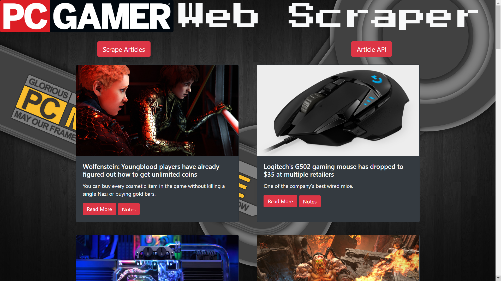

# PC-Gamer-Scaper

This site scrapes all of the articles found on [PC Gamer's](https://www.pcgamer.com/news/) site and displays them in one location. Users can hit the scrape button to scrape for new articles and hit the article API button to see all of the scraped json data stored in the database. Users can also select any of the articles read more button to go the full articles on [PC Gamer's](https://www.pcgamer.com/news/) site. There is also a notes button for each article that allows anyone to set a title and leave a small note which is then stored inside the database for that article. Notes are public to everyone and anyone can change or even delete them completely.

# Link to Github
[Scraper](https://github.com/JakeDudum/PC-Gamer-Scaper)

# Link to Deployed Site (Heroku)
[Heroku](https://tranquil-badlands-33243.herokuapp.com/)

# Built With
- [HTML](https://developer.mozilla.org/en-US/docs/Learn/HTML)
- [CSS](https://developer.mozilla.org/en-US/docs/Web/CSS)
- [Javascript](https://developer.mozilla.org/en-US/docs/Web/JavaScript)
- [Node](https://nodejs.org/en/about/)
- [NPM](https://docs.npmjs.com/about-npm/)
- [MongoDB](https://www.mongodb.com/)

# Node Package's Used
- [Express](https://www.npmjs.com/package/express)
- [Mongoose](https://www.npmjs.com/package/mongoose)
- [Handlebars](https://www.npmjs.com/package/handlebars)
- [Express-Handlebars](https://www.npmjs.com/package/express-handlebars)
- [Cheerio](https://www.npmjs.com/package/cheerio)
- [Axios](https://www.npmjs.com/package/axios)

# Versioning
- [Github](https://github.com/)

# Databases
- [MongoDB Atlas](https://www.mongodb.com/cloud/atlas)

# Authors
### Jake Dudum